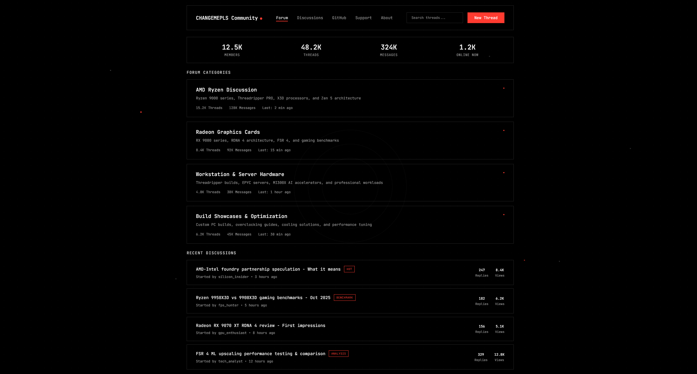
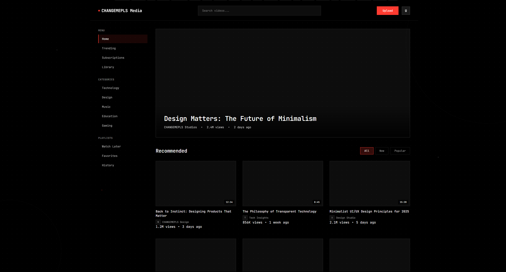
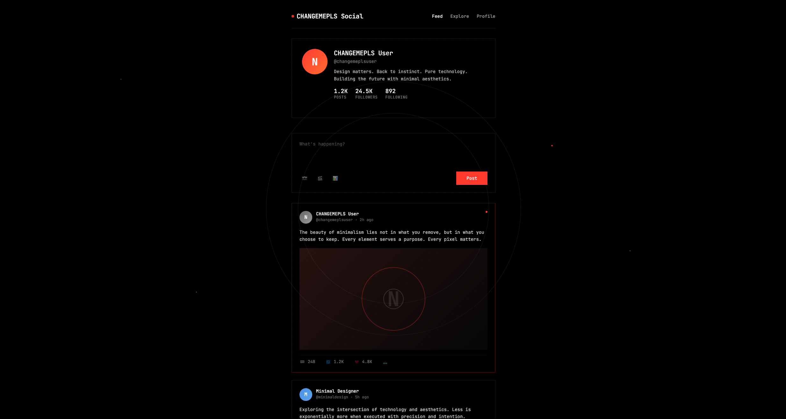
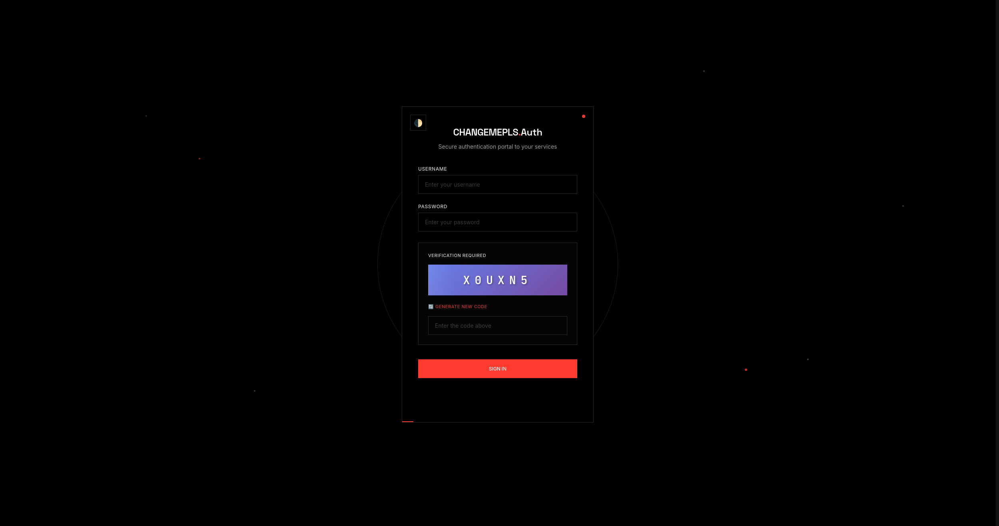

# nothing-sni

## Description

A collection of simple and clean HTML page templates ready to use for your projects.

Inspired by Nothing Tech.

Made by AI.

## Showcase

### [Forum page](https://prettyleaf.github.io/nothing-sni/1.html)

### [Media hosting page](https://prettyleaf.github.io/nothing-sni/2.html)

### [Social media page](https://prettyleaf.github.io/nothing-sni/3.html)

### [Repository hosting page](https://prettyleaf.github.io/nothing-sni/4.html)

### [AI page](https://prettyleaf.github.io/nothing-sni/5.html)

### [OpenWrt* page](https://prettyleaf.github.io/nothing-sni/6.html)

*this template is not related to openwrt at all. just a fan remake made with AI.

### [Cloud page](https://prettyleaf.github.io/nothing-sni/7.html)

### [Bank page](https://prettyleaf.github.io/nothing-sni/8.html)

*this template is not related to any project at all. just a fan remake made with AI.

